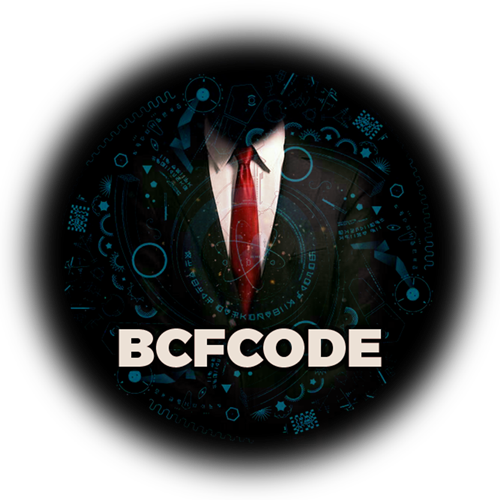

# BCFCODEWars-Clan
Welcome to our extraordinary BCFCODEwars Clan—where coding prowess meets camaraderie, and challenges are conquered with style and innovation!

# Dependencies: 
Please run these commands:  
Under develop...

# 🚀 Discover BCFCODE: Where Innovation Thrives!
## 🌟 Welcome to BCFCODEteam: Igniting Brilliance in Every Line of Code!

In the world of BCFCODEteam, innovation is our language, and code is our medium. We are a collective of visionaries, builders, and dreamers on a mission to reshape the digital landscape. This is not just a team; it's a movement where brilliance converges with bytes, and every commit writes a chapter in our shared success story.

### 🚀 Unleashing Possibilities:
Embark on a journey where boundaries are meant to be pushed. From revolutionary coding projects to groundbreaking tech experiments, BCFCODEteam is where ideas take flight. Our playground is vast, and our ambitions even greater. Join us if you're ready to challenge the status quo and turn imagination into reality.

### 💡 Why Choose BCFCODEteam?

Innovation Elevation: Elevate your skills and thinking to new heights.
Collaboration Hub: Connect with a community that thrives on collaboration and shared success.
Impactful Coding: Code with purpose. Every project, every line matters.
Tech Renaissance: Experience a renaissance of technology where creativity knows no bounds.
### 🤝 Join the Revolution:
BCFCODEteam is not just a place to code; it's a revolution. A revolution that celebrates diversity, creativity, and the unyielding spirit of tech enthusiasts. Your journey to greatness begins here, among the brightest minds and the most ambitious projects.

  

### Ready to redefine the future? BCFCODEteam is calling. Let's code the extraordinary! 🌐✨
# Here is the list of developers working on this project:

Front-End Developers:
- <a href="https://www.linkedin.com/in/morteza-bakhshandeh-813598260/" style="color: yellow;">Morteza Bakhshandeh</a>
- <a href="https://www.linkedin.com/in/majid-babak-aab039156/" style="color: yellow;">Majid Babak</a>

# [©BCFCODEteam](https://github.com/BCFCODE)
[Join our Telegram channel](https://t.me/BCFCODE) | [Follow on Instagram](https://www.instagram.com/bcfcodeteam/?igshid=MzRlODBiNWFlZA%3D%3D)

The use of data from an API, including the CodeWars API, is typically subject to the terms of service and API usage policies of the platform providing the API. It's crucial to review and comply with the terms of use of any API you plan to use.

It's essential to check the CodeWars API documentation and terms of service to understand the limitations, restrictions, and permissions for using their data.

Here are some general considerations:

Check CodeWars API Documentation:
Review the [CodeWars API documentation](https://dev.codewars.com/) to understand what data is available, how to access it, and any restrictions on usage. Pay attention to rate limits, usage policies, and any licensing requirements.

Respect Terms of Service:
Ensure that your usage complies with CodeWars' terms of service. Some APIs have restrictions on commercial use, data redistribution, or creating derivative works.

Attribution and Credits:
If required by the terms of service, provide proper attribution or credits when using data from the CodeWars API.

Data Privacy:
Be mindful of user privacy and sensitive information. Ensure that your use of data aligns with relevant privacy regulations.

API Key and Authentication:
If the CodeWars API requires an API key for access, make sure to obtain and use it according to their guidelines. Keep your API key confidential.

Before proceeding with any project that involves using an API, it's recommended to check the most recent API documentation and terms of service on the CodeWars website or contact CodeWars directly for any specific questions regarding API usage.

##  [CodeWars API documentation](https://dev.codewars.com/)

